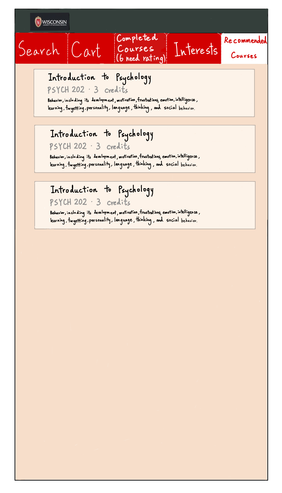

# Course Management Application

## Project Details

This project introduces features of JavaScript, along with showing how a React project works. Additionally, this introduces the different features of React, such as states, props, and more modularized components. I made a course management application based on the modified, real data from the UW course information database.

## Screenshots

Screenshots demonstrating the functionality of the course management application:

